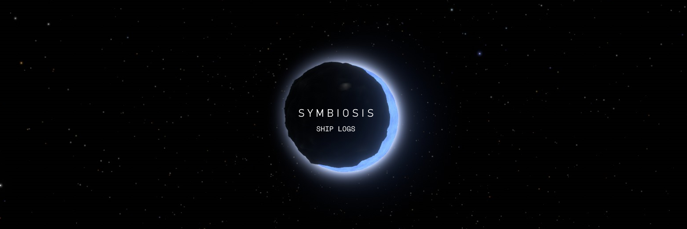

# SYMBIOSIS SHIP LOGS

[Symbiosis](https://github.com/CrypticBird/Outer-Wilds-Symbiosis) by Bird is a fantastic little mod with some fun puzzles to solve and a great atmosphere. However, it is sorely lacking in direction, causing a lot of players to not know where to go. This mod attempts to remedy that by adding ship logs, softly guiding the player where to go without spoiling any puzzle solutions.

Note that because I'm lazy, a few logs can be granted before you would actually learn the fact presented. As long as you're actually engaging in dialogue and not immediately saying good-bye, as well as translating obvious Nomai text, this won't spoil anything.

This mod also fixes a bug where a certain interactable object was much harder to interact with than it should have been.
